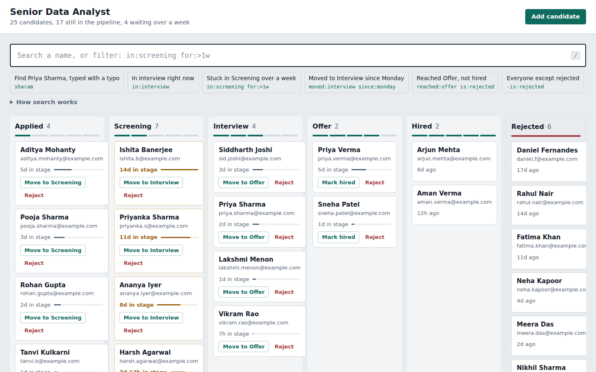
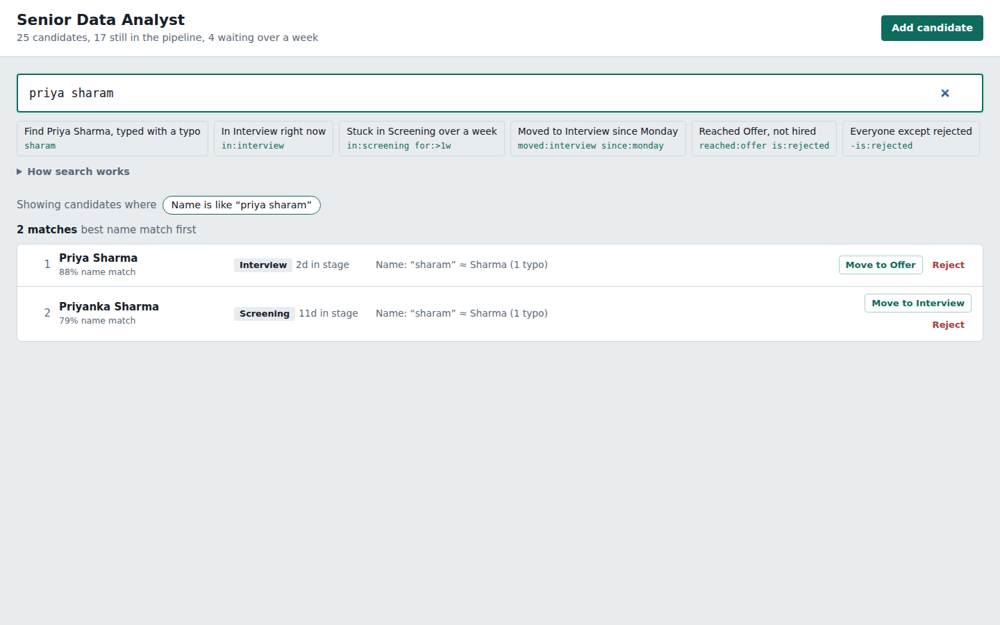
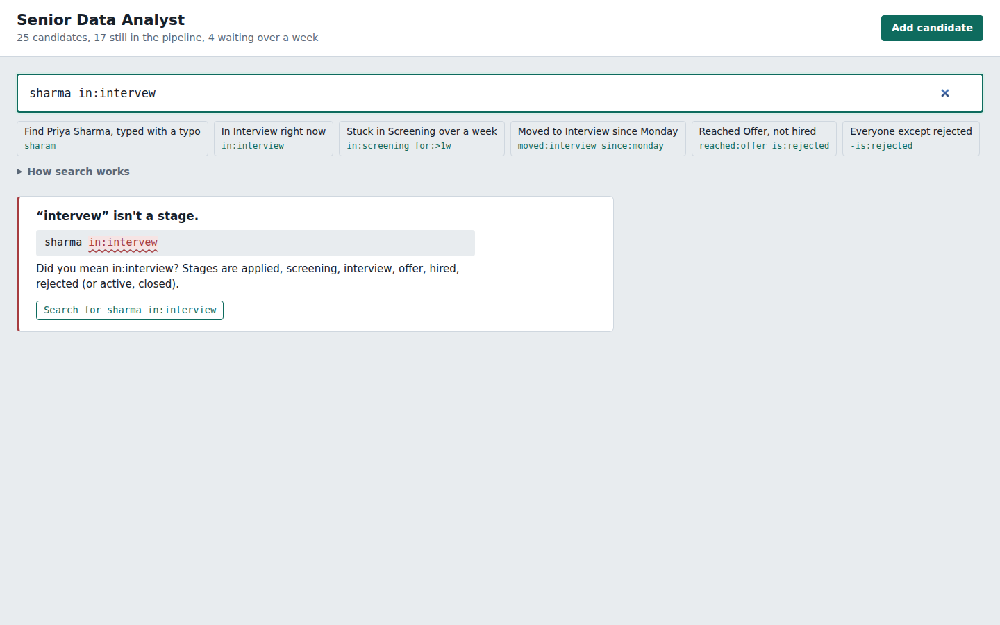
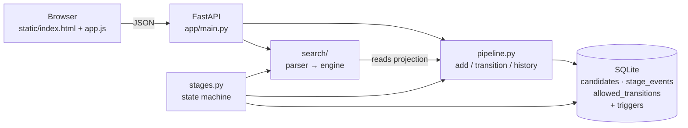

# Mini Hiring Pipeline

By **Praviveek** ([github.com/21pravi](https://github.com/21pravi))

A small web app for a recruiter running one job's pipeline: add candidates, move them
Applied → Screening → Interview → Offer → Hired (or reject them before Hired), see each
candidate's full history, and find people with one search box.



- **Stack:** Python 3.10+, FastAPI, SQLite (stdlib), plain HTML/CSS/JS. No frontend build step.
- **Tests:** 105, covering the state machine, the audit trail (including raw SQL tampering), the query parser, search ranking and the HTTP API.
- **Design summary:** [docs/design.pdf](docs/design.pdf) (rebuild with `pip install reportlab pillow && python docs/build_design_pdf.py --repo <url>`)

---

## How to run

```bash
python -m venv .venv
source .venv/bin/activate          # Windows: .venv\Scripts\activate
pip install -r requirements.txt

python -m scripts.seed --reset     # 25 demo candidates (optional)
uvicorn app.main:app --reload
```

Open http://localhost:8000.

Run the tests:

```bash
python -m pytest
```

The database lives at `data/pipeline.db` (override with `HIRING_DB=/path/to/file.db`).
`--reset` replaces the file rather than deleting rows, because the database refuses deletes.

---

## Using the search box

The search box takes names and filters. Anything that isn't a filter is treated as part of a name.

| Recruiter's question | Query |
|---|---|
| Find Priya Sharma, typed as "sharam" | `sharam` (or `priya sharam`) |
| Who's in Interview right now? | `in:interview` |
| Stuck in Screening for more than a week | `in:screening for:>1w` |
| Moved to Interview since Monday | `moved:interview since:monday` |
| Reached Offer but didn't get hired | `reached:offer is:rejected` |
| Everyone except rejected | `-is:rejected` |
| Combined | `priya -is:rejected`, `sharma in:interview,offer` |

Filters:

| Filter | Meaning |
|---|---|
| `in:` / `stage:` / `is:` | current stage. Comma means OR (`in:screening,interview`). Groups: `active`, `closed` |
| `reached:` | has ever been in that stage |
| `moved:` + `since:` / `before:` | entered that stage in a time window. `monday`, `today`, `yesterday`, `3d ago`, `2026-09-01` |
| `for:` | time in current stage: `>1w`, `>=3d`, `<12h` |
| `-` prefix | negates a filter: `-is:rejected` |
| term with `@` | matches the start of an email: `priya.sharma@` |

All filters are ANDed. Results are ranked by name match, then by how long the person has been
sitting in their current stage (the ones who most need attention come first).

**When a query doesn't make sense, the app says why:**

| Input | Response |
|---|---|
| `in:intervew` | "intervew" isn't a stage. Did you mean `in:interview`? One-click fix. |
| `in:hired in:offer` | Someone can only be in one stage at a time. Use a comma to match either. |
| `reached:hired is:rejected` | Nobody in Rejected can have reached Hired. |
| `who is in interview right now` | Reads like a question; suggests `in:interview`. |
| `zzzz` | No name is close to "zzzz"; shows the nearest names. |
| `priyanka in:offer` | Each part matches someone (1 and 2 people), but no one matches both. |

Impossible queries return an error with the offending part underlined. Valid queries that happen
to match nobody return a per-filter breakdown, so she can see which filter emptied the list.




---

## Architecture



```
app/
  stages.py        stages and every legal transition, defined once
  db.py            schema + triggers that make history append-only
  pipeline.py      add candidate, move candidate, build history
  clock.py         UTC timestamps
  search/
    fuzzy.py       accent folding, typo distance, name scoring
    parser.py      query language -> clauses, plus contradiction checks
    engine.py      filtering, ranking, reasons, "why is this empty"
  main.py          HTTP API + static files
static/            the UI (no build step)
scripts/seed.py    demo data
tests/             pytest suite
docs/              design PDF + its build script, screenshots
ai-logs/           chat logs
```

### API

| Method | Path | |
|---|---|---|
| GET | `/api/candidates` | board data |
| POST | `/api/candidates` | add candidate `{name, email}` |
| GET | `/api/candidates/{id}` | candidate + full history |
| POST | `/api/candidates/{id}/transitions` | `{action: advance\|reject, expected_stage, note?}` |
| GET | `/api/search?q=&tz=` | search |

There is no PUT, PATCH or DELETE. The only way to change a candidate is to append an event.

---

## Decisions and why

**The event log is the source of truth.** Every stage change is a row in `stage_events`. A
candidate's current stage is the last event, not a separate column. That way the stage and the
history can never disagree, and "time in current stage" is just now minus the last event.

**Immutability is enforced in the database, not only in the API.** SQLite triggers reject any
UPDATE or DELETE on events and candidates, and on insert they check that the sequence number is
next, the `from_stage` is the current stage, the move is in `allowed_transitions`, and the
timestamp isn't earlier than the previous one. Tests run raw SQL against the file to prove you
can't edit, delete, skip or backdate. If a future endpoint has a bug, the database still says no.

**One state machine, enforced twice.** `stages.py` lists every legal transition. The same list
fills the `allowed_transitions` table the trigger checks. Changing the process is one edit.

**Moves carry the stage the recruiter saw.** A move request includes `expected_stage`. If the
candidate already moved (double-click, second tab), the request gets a 409 instead of silently
advancing two stages. That is the "no skipping" rule under concurrency.

**Confirmation only for final outcomes.** Hired and Rejected ask for confirmation and an optional
reason (stored in history). Ordinary advances are one click. Trade-off: a mis-click forward is
permanent. The fix for that is a correction event, not an edit (see below).

**A small query language instead of natural language.** The six example questions map to short,
predictable queries. A parser gives exact errors pointing at the bad part, the app echoes back
what it understood in plain English ("Moved to Interview since Mon 21 Sep"), and every rule is
unit tested. An LLM would accept more phrasings but could silently misread "since Monday" or
"didn't get hired", and would be hard to test. Plain-English input isn't ignored: filler words
are dropped and sentence-like queries get a suggested query.

**Fuzzy for names, strict for vocabulary.** Names are unknown data, so they match with typos
(optimal string alignment distance, so "sharam" is one transposition from "Sharma"), prefixes
and accents ("jose" finds José). Stage names and filter keys are a closed set, so a typo there is
an error with a did-you-mean and a one-click fix. Guessing would hide mistakes.

**Errors vs empty results.** A query that can't match anyone by definition (two stages at once,
Hired and Rejected, a date window that ends before it starts) is an error. A valid query that
matches nobody today gets a breakdown of how many people each part matched.

**"Reached Offer but didn't get hired"** is `reached:offer is:rejected`: people whose outcome is
final. `reached:offer -is:hired` also includes people still holding an offer. Both work; the
example chip uses the first because that's what the question means.

**"Since Monday" uses the recruiter's time zone.** The browser sends its IANA zone. Monday
midnight in Bengaluru is not Monday midnight in UTC.

**Search runs in Python over an in-memory projection.** One job means hundreds of candidates,
not millions. Loading them and filtering in Python keeps the matcher, ranker and explanations
in one readable place. At scale the parsed query would compile to SQL (see below).

**No drag-and-drop on the board.** Drag-and-drop invites dropping a card two columns over.
Buttons only offer the legal next move.

---

## What I'd do with more time

- **Correction events.** Record "advanced by mistake" as a new event that points at the old one, so mistakes are fixable without breaking the audit trail.
- **Actor on every event.** Add auth and store who made each move.
- **Tamper evidence.** Hash-chain the events so edits made outside the app (e.g. opening the file directly) are detectable.
- **Natural-language layer on top of the query language.** An LLM translates the question into the query, shows it as chips, and the recruiter confirms. The parser stays the thing that runs.
- **Autocomplete** for filter keys, stages and names in the search box.
- **Scale search.** Compile the parsed query to SQL and use SQLite FTS5 trigram for names.
- **OR across filters and parentheses** in the query language; saved searches.
- **Per-stage "stuck" thresholds** instead of one week for everything.
- **Multiple jobs.**
- **End-to-end tests** with Playwright and CI on GitHub Actions; an accessibility pass.

---

## Where I disagreed with the AI

> **TODO:** replace with a real moment from [`ai-logs/`](ai-logs/): what was proposed,
> what I did instead, and why.
